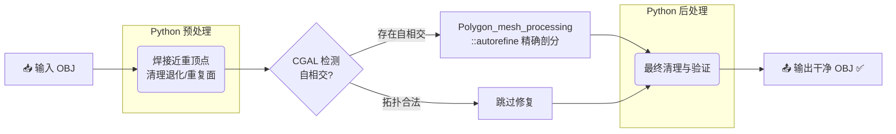

# 🛠️ assembly-mesh-repair

[](https://www.python.org/downloads/)
[](https://www.cgal.org/)
[](https://opensource.org/licenses/MIT)
[](https://ubuntu.com/)

> **专为装配体网格设计的一键修复工具。基于 Python + CGAL，自动完成顶点焊接、退化面清理与自相交修复，输出可直接用于仿真/打印的干净 OBJ 文件。**

**适用场景：** 3D 打印前预处理 ｜ 有限元仿真网格净化 ｜ CAD 装配体导出后处理 ｜ 渲染前拓扑修复

---

## ✨ 修复效果对比

> 左：原始装配体网格（自相交、面片穿插）　→　右：CGAL 自动重新剖分后的拓扑合法网格

| 修复前（`advanced_assembly_case.obj`） | 修复后（`advanced_assembly_case_repaired.obj`） |
|:---:|:---:|
|  |  |
| ❌ 面片严重自相交，几何拓扑非法 | ✅ CGAL Autorefine 重剖分，拓扑合法 |

*(💡 建议将上方路径替换为你实际的 Before/After 截图，两张 Blender 线框对比图效果极佳)*

---

## ⚡️ 核心能力

本工具能自动处理以下装配体常见"坏网格"问题：

| 问题类型 | 描述 | 本工具的处理方式 |
| :--- | :--- | :--- |
| 重复 / 极近顶点 | 导出 OBJ 时浮点误差导致本应共享的顶点分裂 | **Python：按阈值焊接顶点（`eps_v`）** |
| 退化面 / 重复面 | 零面积三角形、完全重叠的面片 | **Python：深度过滤，移除所有退化元素** |
| 自相交三角面 | 装配体零件互相穿插，形成非流形交叉区域 | **CGAL：`Polygon_mesh_processing::autorefine` 精确剖分** |
| 混合型损坏 | 以上多种问题同时出现 | **Python 清理 → CGAL 修复 → Python 后处理，全自动流转** |

---

## 🚀 极速开始

### 📋 环境要求

- Ubuntu 20.04 / 22.04（或其他支持 CGAL 5.x 的 Linux 发行版）
- Python 3.8+，CMake 3.14+

<details>
<summary><b>🛠️ 展开查看：一步完成依赖安装与编译</b></summary>
<br>

```bash
# 第一步：安装系统级依赖
sudo apt-get update && sudo apt-get install -y \
  build-essential cmake \
  libcgal-dev libgmp-dev libmpfr-dev \
  libboost-program-options-dev \
  libboost-system-dev \
  python3 python3-pip

# 第二步：安装 Python 依赖
pip install -r requirements.txt

# 第三步：编译 CGAL Python 桥接模块
cmake -S cgal_bridge -B build/cgal
cmake --build build/cgal -j$(nproc)
```

> ✅ 编译成功后，`build/cgal/` 目录下会生成桥接库（`.so` 文件）。
</details>

### ▶️ 运行修复

```bash
python pipeline.py \
  --input  tests/data/advanced_assembly_case.obj \
  --output_dir tests/out/advanced_assembly_case \
  --eps_v 1e-9 \
  --eps_mode relative_bbox \
  --build_dir build/cgal
```

修复结果将自动保存至：
```
tests/out/advanced_assembly_case/advanced_assembly_case_repaired.obj
```

### 🔧 参数说明

| 参数 | 类型 | 说明 |
| :--- | :---: | :--- |
| `--input` | `str` | 输入 OBJ 文件路径 |
| `--output_dir` | `str` | 输出目录（自动创建） |
| `--eps_v` | `float` | 顶点焊接阈值（默认 `1e-9`） |
| `--eps_mode` | `str` | 阈值模式：`absolute` 或 `relative_bbox` |
| `--build_dir` | `str` | CGAL 桥接模块编译输出目录 |

---

## ⚙️ 工作流原理

本工具采用 **Python（灵活清理）+ CGAL（硬核几何修复）** 混合架构，全自动流转：



---

## 📂 项目结构

```
assembly-mesh-repair/
├── pipeline.py          # 主入口，串联全流程
├── requirements.txt     # Python 依赖
├── cgal_bridge/         # CGAL C++ 桥接模块（CMake 项目）
│   ├── CMakeLists.txt
│   └── autorefine_bridge.cpp
├── tests/
│   ├── data/            # 测试用损坏 OBJ 文件
│   └── out/             # 修复结果输出目录
└── docs/
    └── images/          # README 配图
```

---

## ⚠️ 当前限制

因本人水平有限，并为保持工具轻量专注，当前版本只适用于以下条件：

- **仅支持纯几何 OBJ：** 暂不处理纹理坐标（`vt`）、法线（`vn`）、材质（`mtllib`）等附加信息
- **独立文件处理：** 多个输入文件独立运算，不进行跨文件对齐或合并
- **功能聚焦修复：** 专注于几何错误消除（Healing），不含平滑（Smoothing）或 CAD 语义重建
- **仅支持三角面网格：** 输入多边形面将在预处理阶段自动三角化

---

## 🤝 贡献 & 反馈

欢迎提交 Issue 或 Pull Request！如遇到特定装配体文件无法修复的情况，请附上最小复现文件一并提交。

---

## 📄 许可证

本项目基于 [MIT License](LICENSE) 开源。
