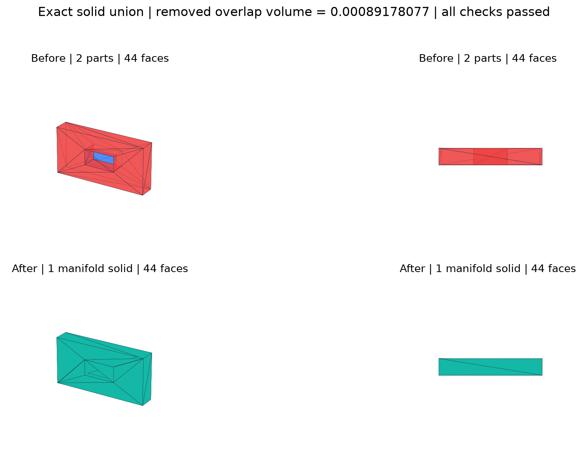
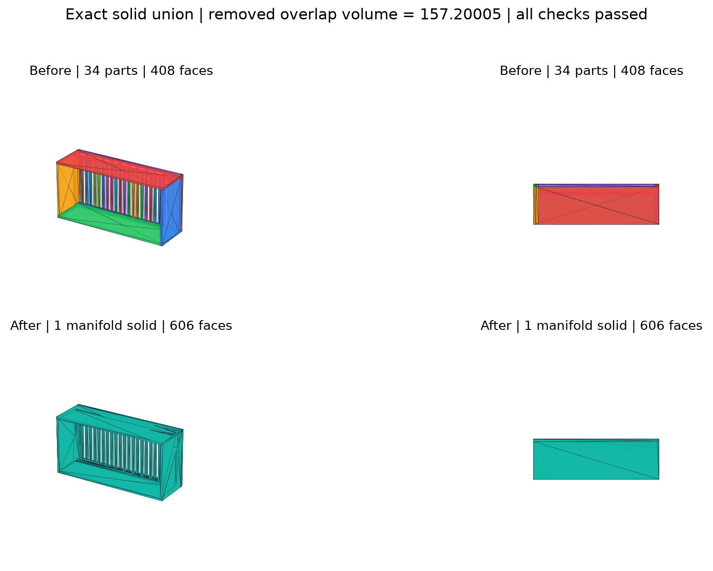
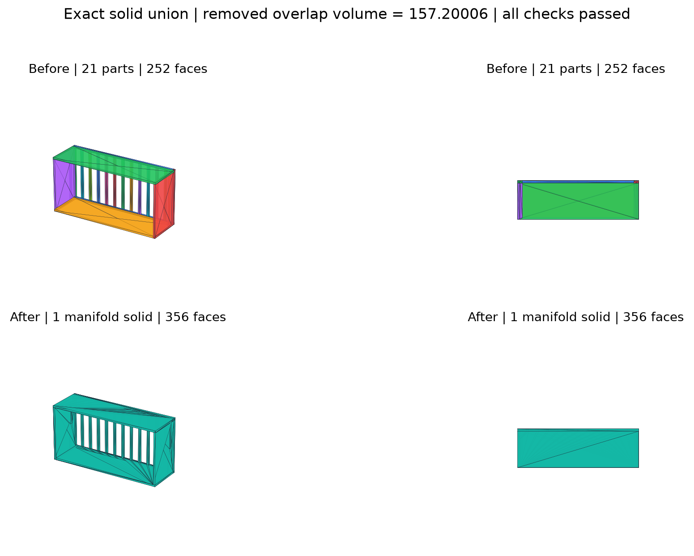
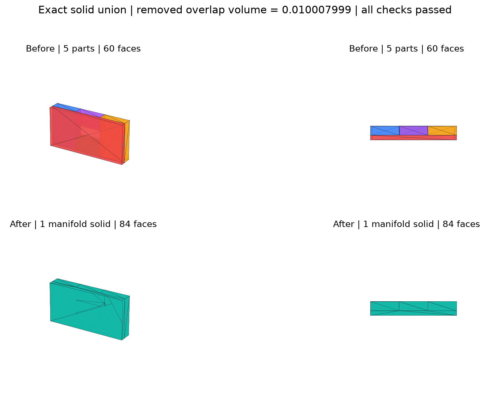

# 四个真实模型修复验证

所有模型均使用 `solid` 精确路径，没有启用近似重建。

| 模型 | 输入零件 | 输入面 | 输出面 | 删除重叠体积 | 闭合 | 绕序 | 正体积 | 非流形边/点 |
|---|---:|---:|---:|---:|---|---|---|---|
| soil_overlap | 2 | 44 | 44 | 0.00089178077 | True | True | True | 0/0 |
| pit_overlap | 34 | 408 | 606 | 157.20005 | True | True | True | 0/0 |
| cell_overlap | 21 | 252 | 356 | 157.20006 | True | True | True | 0/0 |
| shared_surface | 5 | 60 | 84 | 0.010007999 | True | True | True | 0/0 |

## 修复前后对比









## 复现

```bash
python -m pip install -r requirements-visual.txt
python tools/render_validation.py
```

脚本任一检查失败都会以非零状态退出，不会继续生成“成功”报告。
